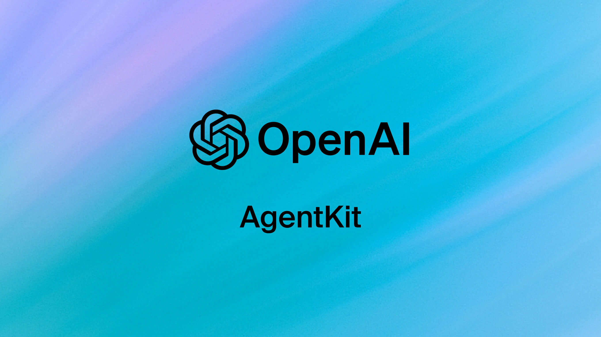

# OpenAI Agent Builder Labs

This repository contains a series of labs designed to help you learn how to use OpenAI's **Agent Builder**, a no-code platform for building intelligent workflow automation. Through these labs, you will gain hands-on experience in creating, enhancing, and integrating workflows with custom frontends.

---

## Labs Overview

### **Lab 01 – Orchestration Flow**

Learn how to design and build an orchestration workflow using Agent Builder. This lab introduces the basics of creating agents and defining their sequence of actions.

### **Lab 02 – Adding MCP Server Tools**

Explore how to integrate external tools like **Zapier** into your workflow. This lab teaches you to connect your agents with third-party applications to enhance automation capabilities.

### **Lab 03 – Guardrails and Workflow Evaluation**

Understand how to add guardrails to your workflow to ensure safe and controlled execution. You will also learn how to evaluate your workflow responses effectively.

### **Lab 04 – Frontend Integration**

Learn how to connect your Agent Builder workflow with a custom frontend, allowing you to create interactive and dynamic user experiences.
