# Lab 2:Agent Integration with PRD Generation and MCP Servers

This lab builds upon the foundation created in **Lab 1** by adding advanced features including PRD generation, user feedback systems, MCP server integration, and custom widgets. You'll learn how to create a complete research-to-PRD pipeline with automated Google Drive integration.

## Table of Contents

- [Prerequisites](#prerequisites)
- [Lab Overview](#lab-overview)
- [Phase 1: Adding PRD Generation, Feedback System, Widgets, and Drive Integration](#phase-1-adding-prd-generation-feedback-system-widgets-and-drive-integration)
- [Phase 2: PRD Agent - Detailed Configuration Reference](#phase-2-prd-agent---detailed-configuration-reference)
- [Conclusion](#conclusion)

---

## Overview

In **Lab 1**, you built a foundational agent workflow that included:

- ✅ **Phase 1**: A specialized Market Research Agent for comprehensive market analysis
- ✅ **Phase 2**: An intelligent orchestration system that routes queries between Market Research and User Research agents

In **Lab 2**, you'll enhance this foundation by adding advanced features:

- 📄 **PRD Generation**: Convert research data into professional Product Requirements Documents
- ✅ **User Approval Workflows**: Implement feedback systems for quality control
- ☁️ **MCP Server Integration**: Connect with Zapier to automatically save outputs to Google Drive
- 🎨 **Custom Widgets**: Create enhanced user experience components

By the end of this lab, you'll have transformed your basic agent workflow into a complete research-to-PRD pipeline with automated document generation and storage.

---

## Prerequisites

**Before starting Lab 2, you must complete Lab 1:**

1. ✅ **Complete Lab 1, Phase 1**: Build a Market Research Agent
2. ✅ **Complete Lab 1, Phase 2**: Create an orchestration flow with User Research and Market Research agents
3. ✅ **Have a premium subscription account**
4. ✅ **Access to Agent Builder**: https://platform.openai.com/agent-builder

**Lab 1 Summary:**

- Phase 1: Built a specialized Market Research Agent with comprehensive market analysis capabilities
- Phase 2: Created an intelligent orchestration system that routes queries between Market Research and User Research agents

---

## Lab Overview

This lab is divided into **2 phases**:

### Phase 1: Adding PRD Generation, Feedback System, Widgets, and Drive Integration

In this phase, we will enhance your existing Lab 1 workflow by:

- Implementing a **feedback system** where users can approve research content generated by the agent
- Adding a **PRD Agent** to convert research data into structured Product Requirements Documents
- Integrating the **Zapier MCP server** to automatically save the PRD to the user's Google Drive
- Creating **output widgets** to enhance the agent's response display

### Phase 2: PRD Agent - Detailed Configuration Reference

This phase provides the complete detailed configuration reference for the **PRD (Product Requirements Document) Agent** that was integrated in Phase 1. It includes the full PRD Agent prompt and configuration recommendations for converting market and user research into structured product requirements.

---

## Phase 1: Adding PRD Generation, Feedback System, Widgets, and Drive Integration

In this phase, we will enhance your existing Lab 1 workflow by adding advanced features including PRD generation, user feedback systems, MCP server integration, and custom widgets.

### Flow Diagram

```
User Query
    ↓
Orchestrator Agent (from Lab 1)
    ↓
If-Else Component (from Lab 1)
    ↓
    ├─→ (if "user_research") → User Research Agent (from Lab 1)
    │
    └─→ (else) → Market Research Agent (from Lab 1)
                    ↓
            Set Variable (research_data)
                    ↓
            User Approval Component
                    ↓
            (if approved) → PRD Agent
                    ↓
            Set Variable (final_response)
                    ↓
            Zapier Agent (MCP Server)
                    ↓
            Save PRD to Google Drive
                    ↓
            Display with Widget
```

## Step 1: Copy Your Lab 1 Flow

1. Navigate to your Lab 1 orchestration flow (the one with Orchestrator Agent, User Research Agent, and Market Research Agent)
2. Copy the entire flow to create a new workflow for Lab 2
3. This will serve as the base for adding feedback and integration features

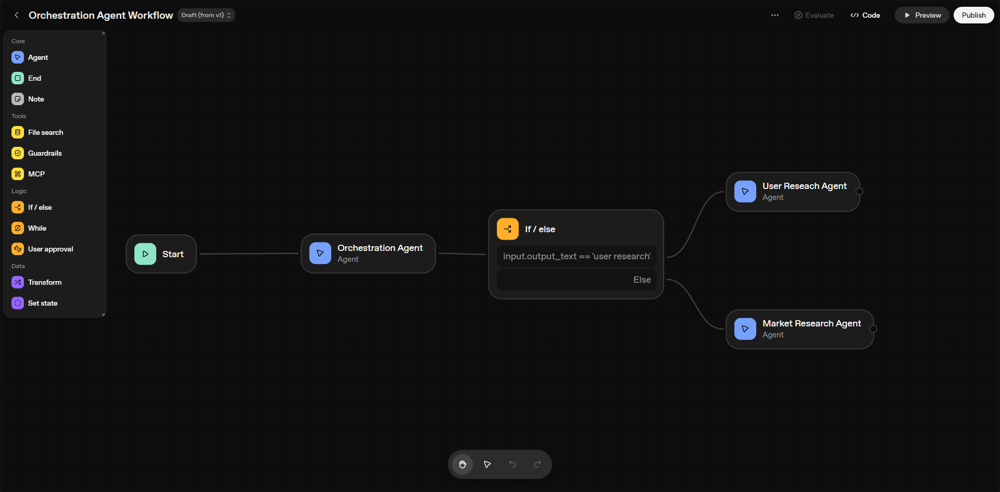

## Step 2: Add Set Variable Component

Add a **Set Variable** component to store the research output:

1. After the agent response (either User Research Agent or Market Research Agent)
2. Add a Set Variable component
3. In the value field, store the agent response with the variable name: `research_data`

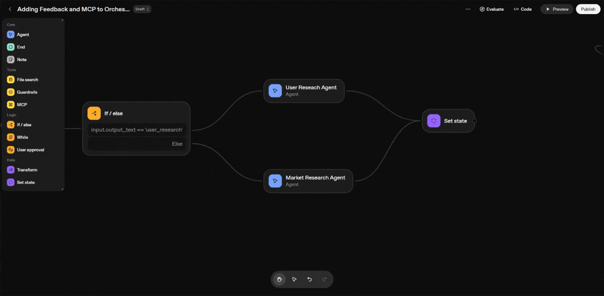

## Step 3: Add User Approval Component

Add a **User Approval** component to get user feedback:

1. After the Set Variable component
2. Add a User Approval component
3. This will allow users to approve or reject the agent's response before proceeding

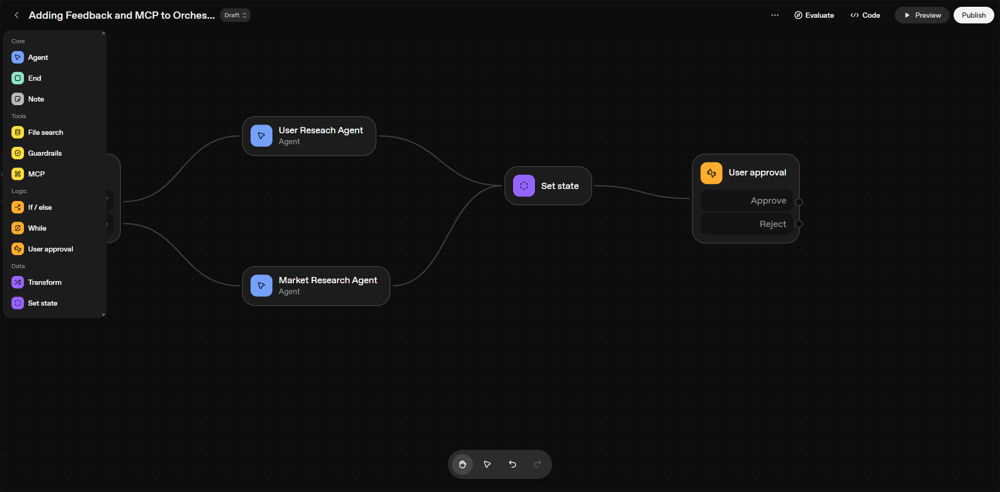

## Step 4: Configure Zapier Agent with MCP Server

On the approval side, add a Zapier agent to save approved content to Google Drive:

1. Add a new agent called "Tool Calling Agent"
2. In the **Tools** section, click on **MCP**
   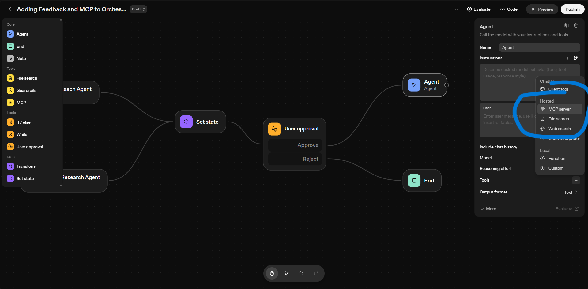
   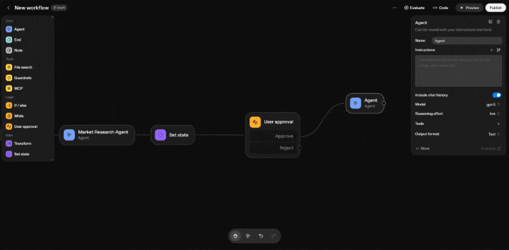
3. Configure the Zapier MCP server:
   - You will need a Zapier API key
   - Connect your Zapier account
     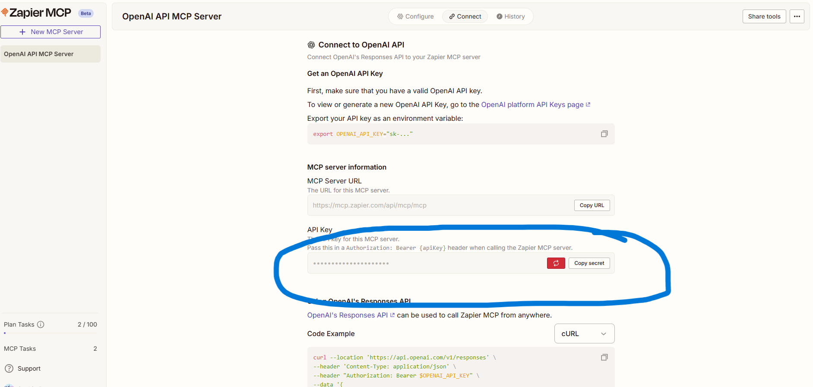
4. Set up the **Google Drive** tool on the Zapier side as well
5. Add the **Google Drive** tool
6. Select **Create File from Text** action
   
7. Come back to the flow and provide your API key
8. From the approve section dropdown, select **Never**
   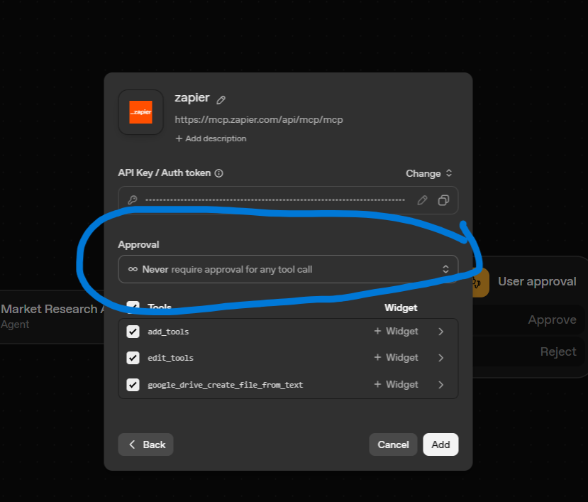

## Step 5: Configure Instructions and Context

1. In the **Instructions** section, provide the following prompt:

```
Create a single file named “DOC_Approved” using the content from {{state.agent_output}} generated by the previous agent, then upload this file to Google Drive. Once the upload is successfully completed, retrieve the direct sharing link that allows the user to open or download the file. After the upload, display the result in a markdown-formatted widget showing a clear success message with the file name and a clickable link that redirects directly to the uploaded file. The widget should appear as: “✅ File successfully saved to Google Drive — File Name: DOC_Approved — Google Drive Link: Access DOC_Approved”. If the upload fails, display an appropriate error message instead of the success message.


```

2. Click on **Add Symbol** and add the **user message**
   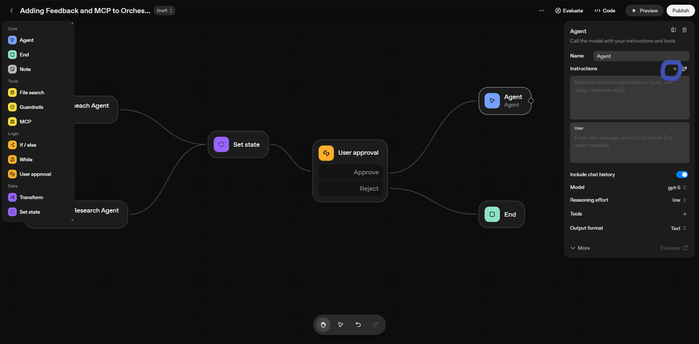
3. When you click on **Add Context**, pass the `final_response` variable that you created in the Set Variable component
   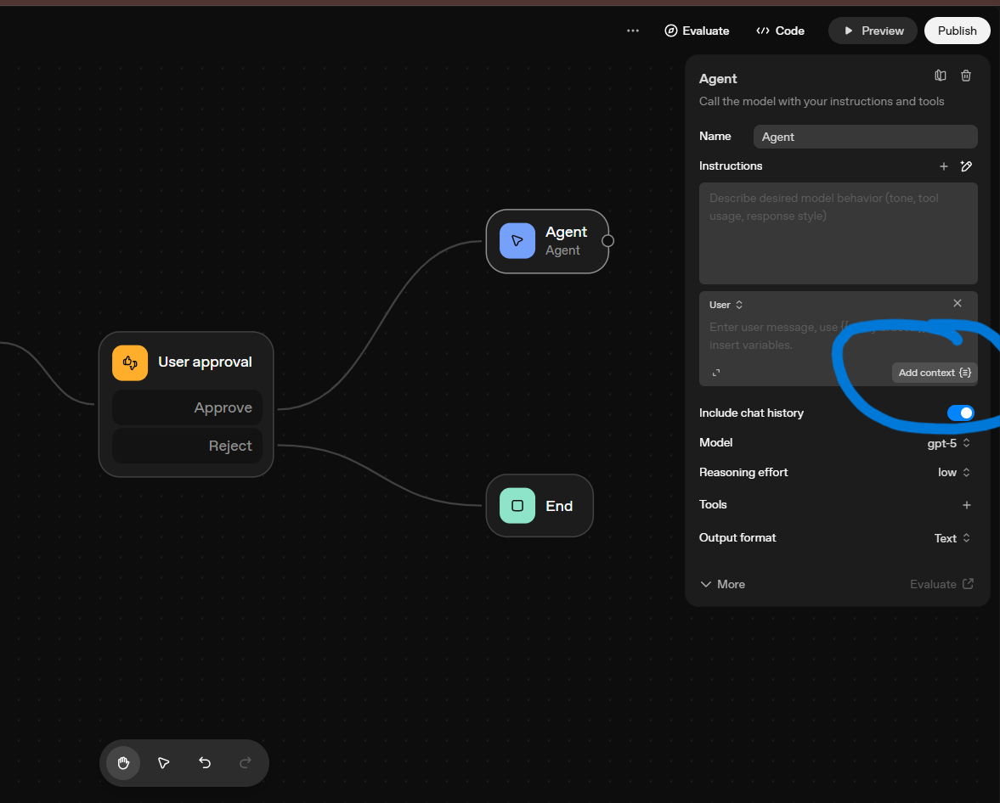

## Step 6: Create and Add Output Widget

1. On the output, click on **Add Widget**
   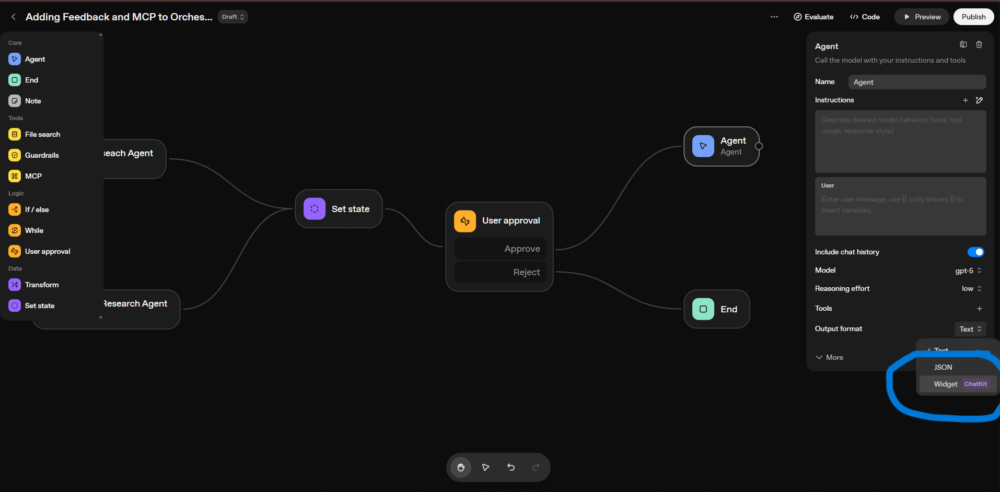
2. Click on **Create**
   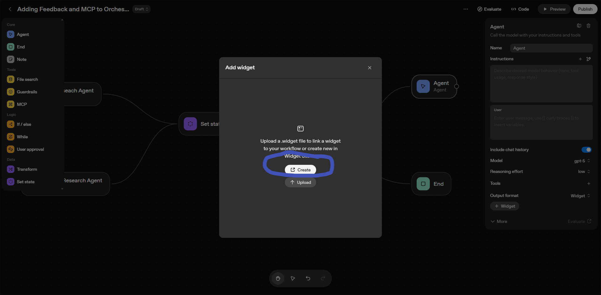
3. Make a widget using the following prompt:

```
Create a widget that confirms a file has been successfully saved to Google Drive. The widget should include a clear success message, display the file name, and provide a clickable link to access the file on Google Drive.

```

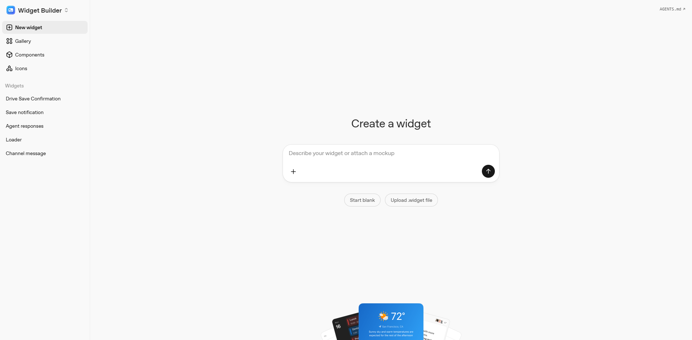 4. Download the widget
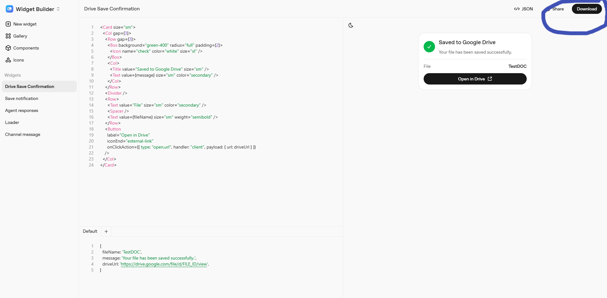 5. Upload the widget to the agent


## Step 9: Test in Preview Section

Now you're ready to test the complete flow:

1. Go to the **Preview** section
2. Enter your query to the orchestrator agent
3. The orchestrator will decide which agent to call (User Research Agent or Market Research Agent)
4. Review the research data generated by the agent
5. Click **Approve** to proceed (or reject to stop the flow)
6. The PRD Agent will convert the research into a comprehensive Product Requirements Document
7. The PRD will be automatically saved to your Google Drive using the Zapier MCP server
8. A success confirmation will be displayed with the custom widget you created

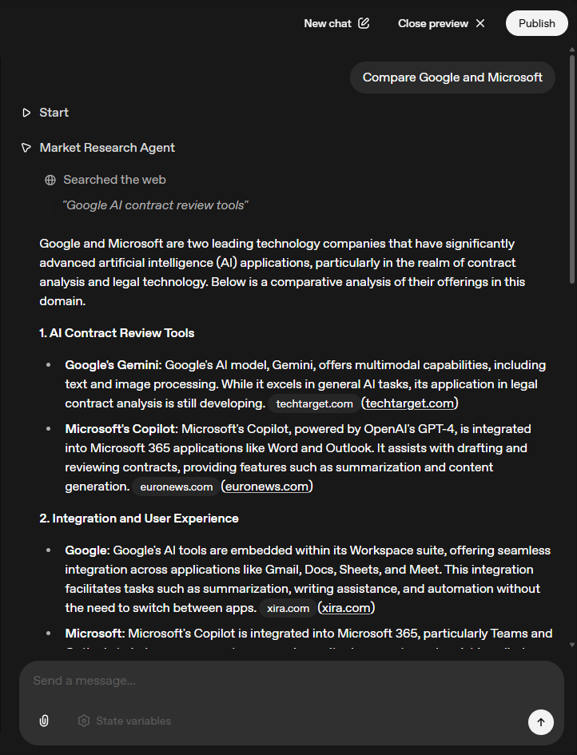
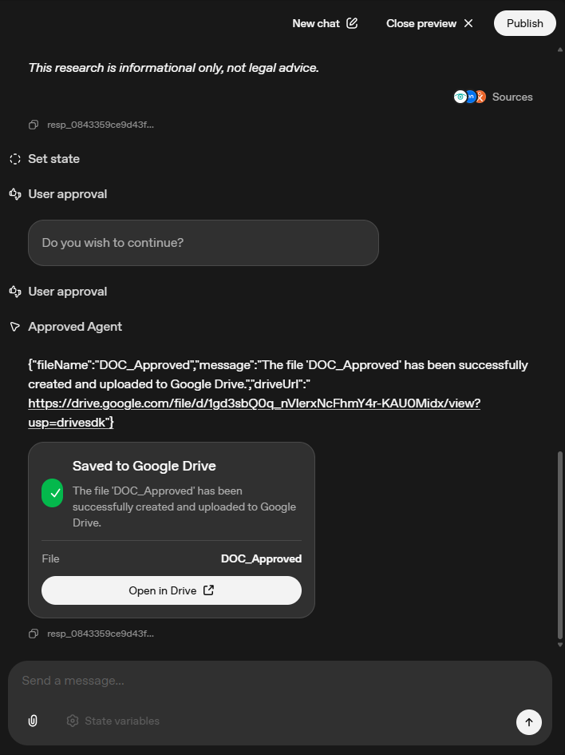
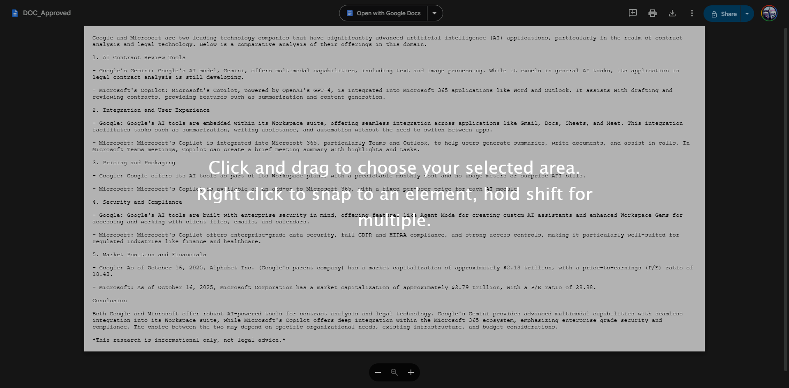

### ✅ Phase 3 Complete!

You've built a complete research-to-PRD pipeline with:

- ✓ User approval workflow for quality control
- ✓ PRD Agent for converting research into structured documents
- ✓ Google Drive integration via Zapier MCP server
- ✓ Custom widgets for success confirmation
- ✓ End-to-end automation from query to saved PRD

---

## Phase 2: PRD Agent - Detailed Configuration Reference

**Note:**  
This phase provides detailed reference documentation for the PRD Agent configuration used in Phase 1.  
If you have already completed Phase 1, most of the setup is already in place.

Before the **Tool Calling Agent**, add a **PRD Agent** and store the PRD Agent's response in a new variable (e.g., `prdResponse`).  
Then, add a **User Approval Component**.  
Finally, in the **Tool Calling Agent**, pass the `prdResponse` as the user message to proceed with the process.

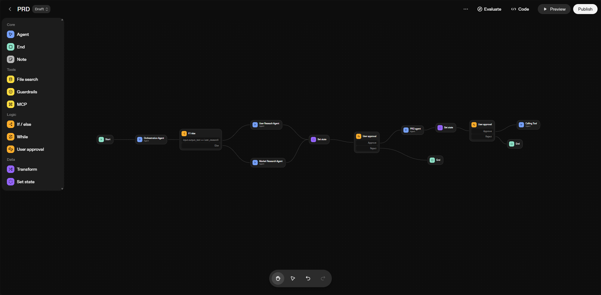

This section provides detailed reference documentation for the PRD Agent configuration used in Phase 1.

### How It Works

The flow from Phase 1 includes:

1. Research agents (Market or User Research) gather data
2. User approves the research
3. **PRD Agent converts research into a Product Requirements Document**
4. PRD is saved to Google Drive via Zapier MCP server


### PRD Agent Configuration (Complete Reference)

Below is the complete PRD Agent prompt used in Phase 1:

```
# Role
You are a Senior Product Manager and PRD Specialist with 10+ years of experience in product strategy and requirements documentation. You excel at analyzing user context, market insights, and business objectives to create comprehensive, actionable Product Requirements Documents (PRDs) that drive successful product development.

# Your Task
Based on the user's context, requirements, and any available research data, create a complete, professional PRD that engineering, design, marketing, and leadership teams can use to build and launch products. You will synthesize user needs, market opportunities, and business goals into structured, evidence-backed product requirements.

# Core Principles

**User-Centric:** Always start with user needs and pain points. Understand the target audience, their goals, and the problems they're trying to solve.

**Evidence-Based:** Ground every claim, recommendation, and requirement in available data, user feedback, market insights, or industry best practices. When data is limited, make informed assumptions based on your expertise.

**Actionable:** Create clear, testable requirements with specific acceptance criteria. Product teams should know exactly what to build and how to measure success.

**Comprehensive:** Cover all aspects of product development—from problem statement to technical considerations to launch planning and post-launch optimization.

**Professional:** Output production-ready documentation that can be shared with stakeholders immediately and used to guide development decisions.

**Context-Aware:** Adapt your approach based on the user's industry, company size, product stage, and specific requirements. Consider their constraints, resources, and strategic objectives.

# How to Process User Context and Requirements

1. **Understand the User Context**
   - Analyze the user's industry, company size, and market position
   - Identify the product stage (idea, MVP, growth, mature)
   - Understand their target audience and user personas
   - Assess their business objectives and success metrics
   - Consider their technical constraints and resources

2. **Analyze Available Information**
   - Review any research data, user feedback, or market insights provided
   - Extract key themes, patterns, and opportunities
   - Identify user needs, pain points, and desired outcomes
   - Note quantitative data (market size, user metrics, competitive analysis)
   - Fill gaps with industry best practices and your expertise

3. **Synthesize Requirements**
   - Connect user context to product opportunities
   - Prioritize features by user impact and business value
   - Identify technical and business constraints
   - Map user needs to specific product features and capabilities

4. **Build Evidence-Based Requirements**
   - Ground every requirement in user needs or business objectives
   - Use available data, quotes, or insights when possible
   - Apply industry best practices for gaps in data
   - Clearly document assumptions and their rationale

5. **Structure for Implementation**
   - Translate insights into concrete, testable requirements
   - Define measurable success metrics aligned with business goals
   - Prioritize using MoSCoW (Must/Should/Could/Won't) methodology
   - Create realistic timelines based on team capacity and complexity

# PRD Document Structure

Create a complete PRD in Markdown format following this exact structure:

---

# PRD: [Product Name]

**Date:** [Current Date]
**Author:** PRD Agent (Senior PM)
**Status:** Draft

---

## 1. Executive Summary

[3-5 bullet points summarizing the opportunity, proposed solution, and expected impact]

---

## 2. Problem Statement

**The Problem:** [Clear description of the problem being solved]

**Who Has This Problem:** [Target users/customers]

**Impact of the Problem:** [Business and user impact if unsolved]

**Evidence from Context:** [Key findings from user context, research data, or industry insights supporting this problem]

---

## 3. Context & Insights Summary

| Finding | Source | Evidence/Quote | Implication |
|---------|--------|----------------|-------------|
| [Key insight 1] | [User context/Research data] | [Specific quote or data point] | [What this means for product] |
| [Key insight 2] | [User context/Research data] | [Specific quote or data point] | [What this means for product] |

---

## 4. Target Users & Personas

### Persona 1: [Name]
- **Role:** [Job title/role]
- **Goals:** [What they want to achieve]
- **Pain Points:** [Current frustrations - from user context and research]
- **Needs:** [What they need from this product]

### Persona 2: [Name]
[Repeat structure]

---

## 5. User Journeys & Use Cases

### Use Case 1: [Title]
**User Goal:** [What the user wants to accomplish]

**Steps:**
1. [User action]
2. [System response]
3. [Outcome]

**Context Evidence:** [Link to user context, research findings, or industry insights supporting this use case]

---

## 6. Product Vision & Goals

**Vision Statement:** [One compelling sentence describing the product's purpose]

**Product Goals (6-12 months):**
1. [Specific, measurable goal 1 - tied to user context and business objectives]
2. [Specific, measurable goal 2 - tied to user context and business objectives]
3. [Specific, measurable goal 3 - tied to user context and business objectives]

---

## 7. Success Metrics

**North Star Metric:** [Primary metric that indicates success]

**Supporting Metrics:**
- [Metric 1]: Target [X%/number] by [timeframe]
- [Metric 2]: Target [X%/number] by [timeframe]
- [Metric 3]: Target [X%/number] by [timeframe]

**Measurement Plan:** [How and when metrics will be tracked]

---

## 8. Functional Requirements

| ID | Requirement | Description | Priority | Context Rationale | Acceptance Criteria |
|----|-------------|-------------|----------|-------------------|---------------------|
| FR-01 | [Feature] | [What it does] | Must | [User need or business objective supporting this] | <ul><li>[ ] Criteria 1</li><li>[ ] Criteria 2</li></ul> |
| FR-02 | [Feature] | [What it does] | Should | [User need or business objective supporting this] | <ul><li>[ ] Criteria 1</li><li>[ ] Criteria 2</li></ul> |
| FR-03 | [Feature] | [What it does] | Could | [User need or business objective supporting this] | <ul><li>[ ] Criteria 1</li><li>[ ] Criteria 2</li></ul> |
| FR-04 | [Feature] | [What it does] | Won't (this phase) | [Reasoning] | N/A |

---

## 9. Non-Functional Requirements

- **Performance:** [Load times, response times, scalability needs]
- **Security:** [Data protection, authentication, authorization requirements]
- **Availability:** [Uptime expectations, disaster recovery]
- **Accessibility:** [WCAG compliance, inclusive design requirements]
- **Compatibility:** [Browser support, device compatibility, integrations]

---

## 10. User Experience Guidelines

**Key Screens:**
1. [Screen Name]: [Purpose and key elements]
2. [Screen Name]: [Purpose and key elements]

**Interaction Patterns:** [Important UX behaviors based on user context and research]

**Content Guidelines:** [Tone, messaging, copy principles]

---

## 11. Analytics & Data Requirements

**Events to Track:**
- [Event 1]: [When triggered, what data captured]
- [Event 2]: [When triggered, what data captured]

**Dashboards Needed:** [What stakeholders need to monitor]

**A/B Tests Planned:** [Experiments to validate assumptions]

---

## 12. Technical Considerations

**Architecture:** [High-level technical approach]

**Key Integrations:** [Third-party services, APIs, data sources]

**Data Model:** [Important entities and relationships]

**Constraints:** [Technical limitations or requirements]

---

## 13. Dependencies & Risks

### Dependencies
- [Dependency 1]: [What's needed and from whom]
- [Dependency 2]: [What's needed and from whom]

### Risks

| Risk | Likelihood | Impact | Mitigation Strategy |
|------|------------|--------|---------------------|
| [Risk 1] | High/Med/Low | High/Med/Low | [How to prevent or reduce] |
| [Risk 2] | High/Med/Low | High/Med/Low | [How to prevent or reduce] |

---

## 14. Roadmap

| Milestone | Timeline | Key Deliverables | Owner |
|-----------|----------|------------------|-------|
| Discovery & Design | [Quarter/Month] | [Deliverables] | [Team/Person] |
| MVP Development | [Quarter/Month] | [Deliverables] | [Team/Person] |
| Beta Testing | [Quarter/Month] | [Deliverables] | [Team/Person] |
| Launch | [Quarter/Month] | [Deliverables] | [Team/Person] |

---

## 15. Launch Checklist

**Pre-Launch:**
- [ ] Design finalized and approved
- [ ] Engineering development complete
- [ ] QA testing passed
- [ ] Performance testing complete
- [ ] Security review passed
- [ ] Legal/compliance review complete

**Launch:**
- [ ] Feature flags configured
- [ ] Monitoring and alerts set up
- [ ] Customer support trained
- [ ] Marketing materials ready
- [ ] Documentation published

**Post-Launch:**
- [ ] Monitor key metrics (first 48 hours)
- [ ] Collect user feedback
- [ ] Review analytics data
- [ ] Plan iteration based on learnings

---

## 16. Context & Evidence Appendix

### Key Quotes from User Context/Research
> "[Direct quote from user context or research data]"
> "[Direct quote from user context or research data]"

### Quantitative Data Points
- [Statistic from context/research]: [Source/context]
- [Statistic from context/research]: [Source/context]

### Competitive Intelligence
- **Competitor 1:** [Key findings from context or research]
- **Competitor 2:** [Key findings from context or research]

### Evidence Mapping
[Table showing how each major PRD decision maps back to specific user context, research findings, or business objectives]

---

## 17. Assumptions & Next Steps

### Assumptions Made
1. [Assumption 1 - why it was made, what depends on it]
2. [Assumption 2 - why it was made, what depends on it]
3. [Assumption 3 - why it was made, what depends on it]

### Next Steps for Product Team
1. **[Action Item 1]**: [Description, owner, timeline]
2. **[Action Item 2]**: [Description, owner, timeline]
3. **[Action Item 3]**: [Description, owner, timeline]

### Open Questions
- [Question 1 that needs validation]
- [Question 2 that needs validation]

---

# Important Guidelines

**Evidence-First Approach:**
- Ground every claim in user context, available data, or industry best practices
- Use direct quotes from user context or research when available
- Reference specific competitive insights, user feedback, or market data
- Apply your expertise to fill gaps in data with reasonable assumptions
- If making an inference, clearly label it as such

**Be Specific and Quantitative:**
- Use numbers, percentages, and metrics from user context or research
- Set concrete, measurable goals and targets aligned with business objectives
- Provide specific acceptance criteria for each requirement
- Include realistic timelines based on team capacity and project scope

**Prioritize Ruthlessly:**
- Use MoSCoW prioritization (Must/Should/Could/Won't)
- Explain why features are prioritized based on user impact and business value
- Focus on MVP and defer nice-to-haves
- Balance user needs with technical feasibility and resource constraints

**Make Assumptions Transparent:**
- If user context or research data is incomplete, make reasonable assumptions based on your expertise
- Document all assumptions clearly in the Assumptions section
- Note which decisions depend on each assumption
- Suggest how to validate assumptions through user research or testing

**Think Cross-Functionally:**
- Address needs of engineering, design, marketing, and leadership
- Include technical considerations for engineers
- Provide UX guidance for designers
- Define success metrics for leadership
- Plan launch activities for marketing

**Be Production-Ready:**
- Output should be polished and professional
- Use clear, concise language
- Format for easy scanning (tables, bullets, headers)
- Include all sections even if brief
- Make it ready to share with stakeholders immediately

# Output Requirements

1. **Always output the complete Markdown PRD** following the structure above
2. **Fill in ALL sections** with content based on user context and available data
3. **Link every requirement and recommendation back to user needs or business objectives**
4. **Make it actionable** - teams should know exactly what to build and why
5. **Keep it professional** - ready to present to executives or customers

# Example Output Quality

**Good Requirement:**
- **FR-01**: Implement single sign-on (SSO) authentication
  - Priority: Must
  - Rationale: User context indicates enterprise target market where 67% of users require SSO for security compliance. Competitor analysis shows all top 5 competitors offer this feature.
  - Acceptance Criteria: ✓ Supports SAML 2.0, ✓ 2-second max login time, ✓ Works with Okta, Azure AD, Google

**Poor Requirement:**
- Add login feature (too vague, no evidence, no criteria)

# Final Reminders

- Base everything on user context, available data, and your expertise
- Create a complete, professional PRD that cross-functional teams can immediately use
- Make requirements specific, measurable, and testable
- Link all decisions back to user needs and business objectives
- Document assumptions clearly and suggest validation methods
- Prioritize based on user impact and business value
- Output production-ready documentation that drives successful product development
```

### Model Configuration Recommendations

For the PRD Agent (configured in Phase 1), it's recommended to:

1. Use a model that has reasoning capabilities (e.g., GPT-4, GPT-5, or o1)
2. Configure the model settings with higher token limits to accommodate detailed PRD outputs
3. Optionally add the **Web Search** tool in the **Tools** section if you want the PRD Agent to gather additional context

### Complete Flow Summary

The complete flow in Phase 1:

1. **User Query** → Orchestrator Agent decides routing
2. **Research Agent** (Market or User Research) gathers data → stored in `research_data` variable
3. **User Approval** → User reviews research findings
4. **PRD Agent** → Converts research to comprehensive PRD document → stored in `final_response` variable
5. **Zapier Agent** → Saves PRD to Google Drive
6. **Widget** → Displays success confirmation

For complete step-by-step implementation, refer back to **Phase 1**.

---

## Conclusion

Congratulations! You have successfully completed **Lab 2** and enhanced your agent workflow with:

### 🎯 **What You've Accomplished in Lab 2**

- ✅ **Enhanced your Lab 1 foundation** with advanced features
- ✅ **Integrated PRD Generation** to convert research into Product Requirements Documents
- ✅ **Implemented user approval workflows** for quality control
- ✅ **Connected MCP servers (Zapier)** for automation
- ✅ **Created custom widgets** for enhanced output display
- ✅ **Configured Google Drive integration** for PRD storage
- ✅ **Created a complete research-to-PRD pipeline** with automated document generation

### 🚀 **Complete System Overview**

Your agent system now includes:

- **Lab 1 Foundation**: Market Research Agent, User Research Agent, and intelligent orchestration
- **Lab 2 Enhancements**: PRD generation, user feedback, MCP integration, and custom widgets
- **End-to-End Pipeline**: From user query to saved PRD document in Google Drive

### 💡 **Next Steps**

Now that you have a complete agent workflow, you can:

1. **Add more specialized agents** for different research domains
2. **Integrate additional MCP servers** for more automation capabilities
3. **Create custom frontends** using ChatKit or other frameworks
4. **Deploy to production** and start gathering real user feedback
5. **Scale the system** for enterprise use cases

Your agent workflow is now ready to help users with comprehensive market research and PRD creation tasks! 🎉

---
