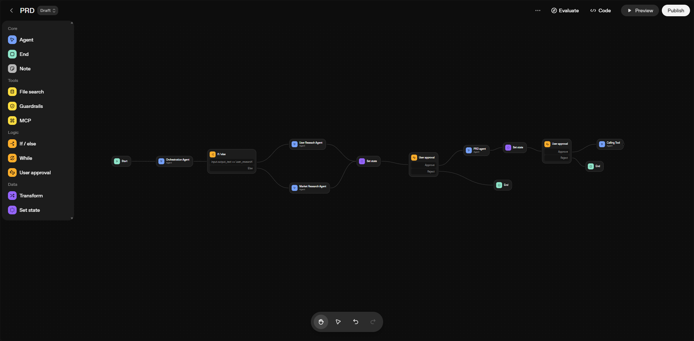
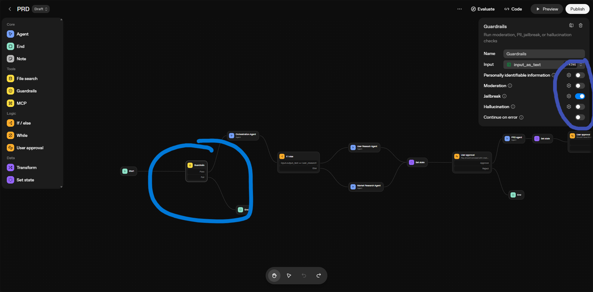
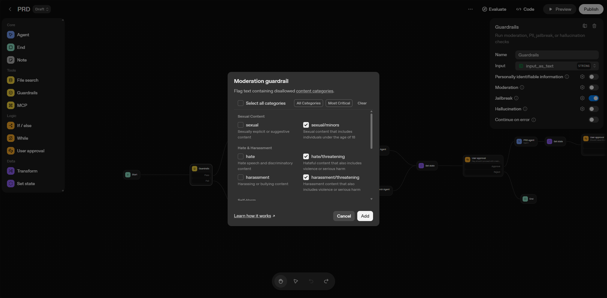
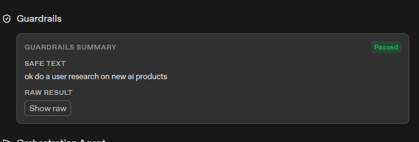
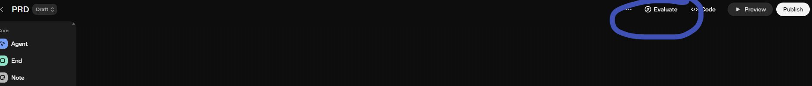
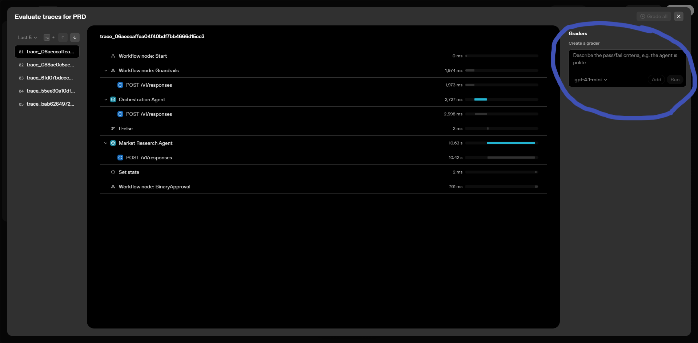
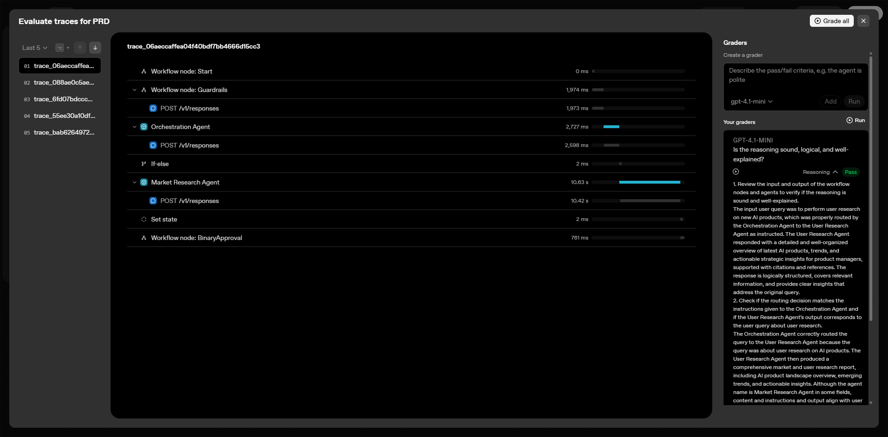

# Lab 3: Response Evaluation and Guardrails in Agent Builder

This lab builds upon your complete agent workflow from **Lab 1** and **Lab 2** by adding essential quality control mechanisms. You'll learn how to implement guardrails to control agent behavior and set up a response evaluation system (GRADR) to assess and improve the quality of your agent's outputs.

## Table of Contents

- [Prerequisites](#prerequisites)
- [Lab Overview](#lab-overview)
- [Phase 1: Implementing Guardrails](#phase-1-implementing-guardrails)
- [Phase 2: Setting Up Response Evaluation (GRADR)](#phase-2-setting-up-response-evaluation-gradr)
- [Phase 3: Advanced Quality Control Features](#phase-3-advanced-quality-control-features)
- [Conclusion](#conclusion)

---

## Phase 1: Implementing Guardrails

In this phase, you'll add guardrails to your existing Lab 2 workflow to control agent behavior and ensure appropriate responses. Guardrails help prevent agents from generating inappropriate, off-topic, or harmful content.

### Step 1: Access Your Existing Workflow

1. Navigate to your **Agent Builder** dashboard
2. Open the workflow you created in **Lab 2** (the one with PRD generation, feedback systems, and Google Drive integration)
3. This will be your base workflow for adding guardrails

### Step 2: Understanding Guardrails

Guardrails are safety mechanisms that:

- **Control Content**: Prevent inappropriate, harmful, or off-topic responses
- **Enforce Boundaries**: Keep agents within defined scope and capabilities
- **Ensure Compliance**: Meet safety and regulatory requirements
- **Improve Quality**: Maintain consistent, professional responses

### Step 3: Add Guardrails Component to Your Workflow

1. Click on the **Guardrails component** in your workflow
2. Click **Add Guardrail Component to the flow**
3. Your flow will now look like this as you can see in the image

### Step 4: Configure Guardrail Parameters

1. Click on the **Guardrails component** in the sidebar
2. You can see different parameters like **Jailbreak** and **Moderation** to set the guardrails
3. If it passes, it will process; if it doesn't, it will end the flow

### Step 5: Configure Moderation Settings

1. Click on the **settings icon** of each guardrail
2. You can set the values like in moderation whether you want to check for hate speech or violence, etc.

3. Now go to the previous section to test it. It will show you something like this if your query passes the guardrails.

---

## Phase 2: Setting Up Response Evaluation (GRADR)

In this phase, you'll implement a response evaluation system to assess the quality of your agent's outputs.

### Step 1: Add Evaluation Component

1. Click on the **Evaluate** component in your workflow
2. This will add response evaluation capabilities to your flow

### Step 2: Configure Evaluation Graders

1. In the sidebar, you can add graders such as:
   - "Is the reasoning sound, logical, and well-explained?"
   - "Does the response address the user's question completely?"
   - "Is the response professional and appropriate?"
2. Click **Run** to test the evaluation

### Step 3: Review Evaluation Results

1. If the response of your workflow satisfies the evaluation conditions, it will mark it as **PASS**
2. If it doesn't meet the criteria, it will mark it as **FAIL**
3. You can review the detailed evaluation feedback

---

## Conclusion

Congratulations! You have successfully completed **Lab 3** and enhanced your agent workflow with comprehensive quality control:

### **What You've Accomplished in Lab 3**

- ✅ **Implemented Guardrails**: Added safety controls and content filtering
- ✅ **Set Up Response Evaluation**: Implemented GRADR system for quality assessment
- ✅ **Added Advanced Controls**: Built monitoring and optimization features
- ✅ **Enhanced Quality**: Ensured professional, appropriate responses

---
