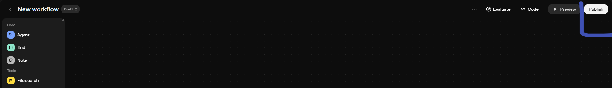
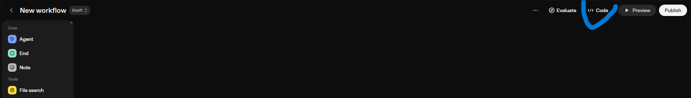
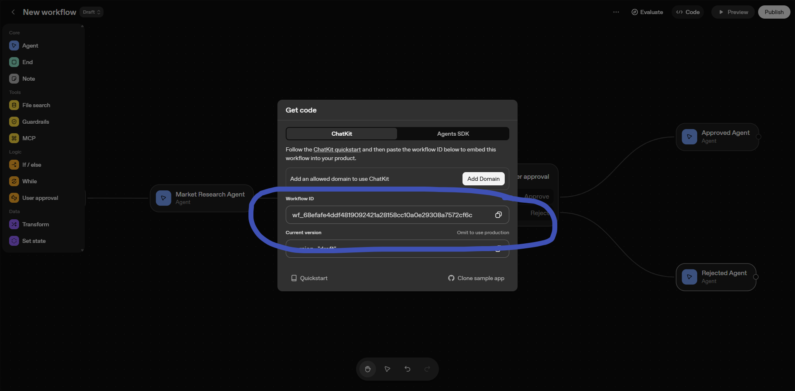
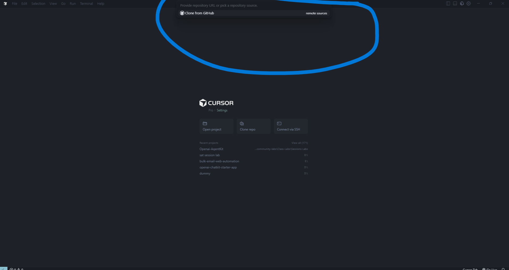
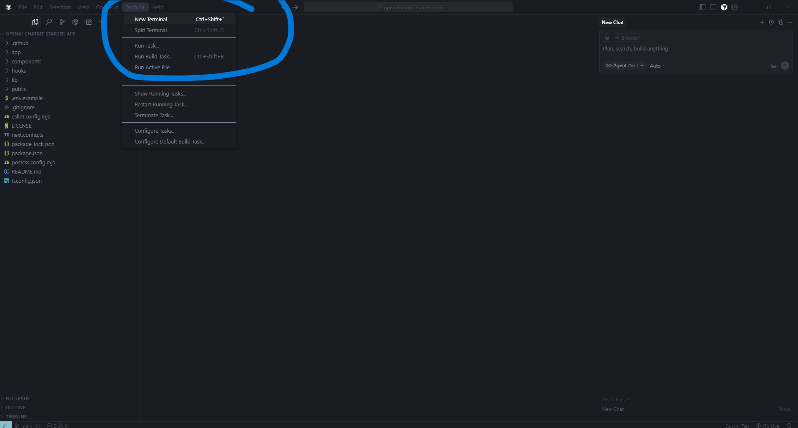
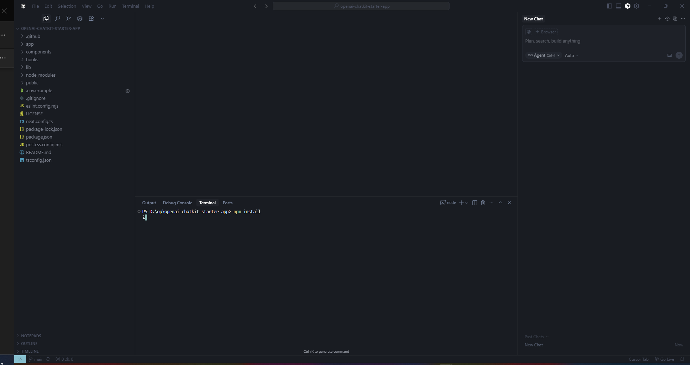
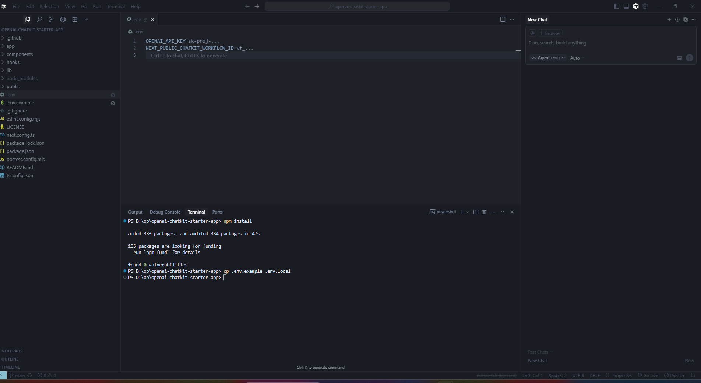
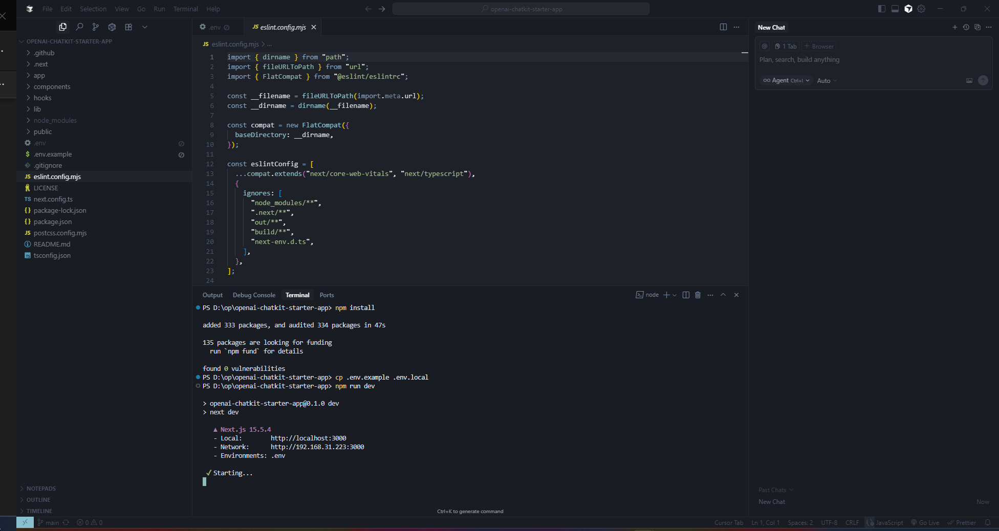
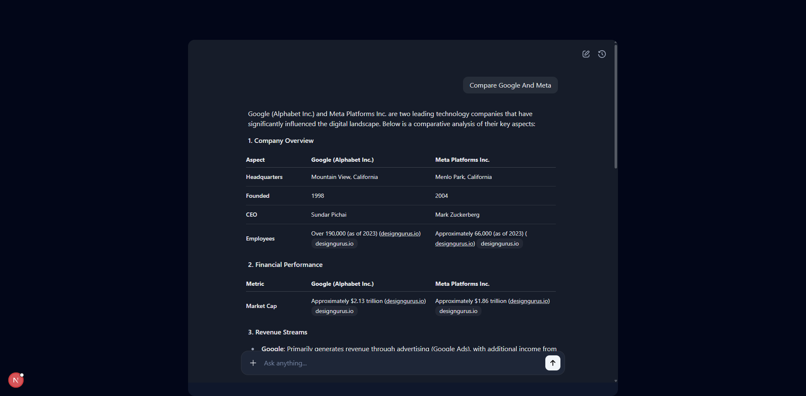

# Lab 4: Integrating a Custom Frontend with ChatKit

This lab builds upon your complete agent workflow from **Lab 1**, **Lab 2**, and **Lab 3** by adding a custom frontend interface using ChatKit. You'll learn how to deploy your agent with a fully customized user interface that provides a professional, production-ready experience.

## Table of Contents

- [Prerequisites](#prerequisites)
- [Lab Overview](#lab-overview)
- [Phase 1: Publishing Your Workflow](#phase-1-publishing-your-workflow)
- [Phase 2: Setting Up ChatKit Development Environment](#phase-2-setting-up-chatkit-development-environment)
- [Phase 3: Configuring and Deploying Your Frontend](#phase-3-configuring-and-deploying-your-frontend)
- [Conclusion](#conclusion)

---

## Overview

In **Lab 1**, you built a foundational agent workflow with:

- ✅ **Phase 1**: Market Research Agent for comprehensive market analysis
- ✅ **Phase 2**: Intelligent orchestration system with User Research and Market Research agents

In **Lab 2**, you enhanced the workflow with:

- ✅ **Phase 1**: PRD Generation, user feedback systems, and MCP integration
- ✅ **Phase 2**: Detailed PRD Agent configuration and Google Drive integration

In **Lab 3**, you added quality control features:

- ✅ **Phase 1**: Guardrails for safety and content control
- ✅ **Phase 2**: Response evaluation (GRADR) system

In **Lab 4**, you'll create a custom frontend:

- 🌐 **Custom Frontend**: Deploy with ChatKit for a beautiful user interface
- 🚀 **Production Deployment**: Make your agent accessible via web browser
- 🎨 **Custom UI**: Fully customizable user experience
- 📱 **Responsive Design**: Works on desktop and mobile devices

By the end of this lab, you'll have a complete, deployable agent system with a professional frontend interface.

---

## Prerequisites

**Before starting Lab 4, you must complete:**

1. ✅ **Complete Lab 1**: Market Research Agent and orchestration flow
2. ✅ **Complete Lab 2**: PRD generation, feedback systems, and MCP integration
3. ✅ **Complete Lab 3**: Guardrails and response evaluation
4. ✅ **Have a premium subscription account**
5. ✅ **Access to Agent Builder**: https://platform.openai.com/agent-builder
6. ✅ **Node.js installed** on your development machine
7. ✅ **Git installed** for cloning repositories

**Lab 1-3 Summary:**

- Lab 1: Built foundational agents and intelligent orchestration
- Lab 2: Added PRD generation, user feedback, and Google Drive integration
- Lab 3: Implemented guardrails and response evaluation systems

---

## Lab Overview

This lab is divided into **3 phases**:

### Phase 1: Publishing Your Workflow

In this phase, you'll:

- Publish your complete agent workflow
- Obtain the workflow ID for frontend integration
- Prepare your workflow for production deployment

### Phase 2: Setting Up ChatKit Development Environment

In this phase, you'll:

- Clone the ChatKit starter template
- Set up your development environment
- Install required dependencies

### Phase 3: Configuring and Deploying Your Frontend

In this final phase, you'll:

- Configure ChatKit with your workflow ID
- Customize the user interface
- Deploy your agent with a custom frontend

---

## Phase 1: Publishing Your Workflow

In this phase, you'll publish your complete agent workflow and obtain the necessary credentials for frontend integration.

### Step 1: Publish Your Workflow

1. Navigate to your **Agent Builder** dashboard
2. Open the workflow you created in **Lab 3** (the one with guardrails and response evaluation)
3. Click on **Publish** to publish your workflow



### Step 2: Get Your Workflow ID

1. Once published, click on the **Code** button



2. Copy the **Workflow ID** that is displayed (it will start with `wf_`)



### Step 3: Verify Organization Settings

If your workflow uses a model requiring organization verification (such as GPT-5):

1. Visit your [organization settings](https://platform.openai.com/settings/organization/general)
2. Click on "Verify Organization"
3. Complete the verification process

### ✅ Phase 1 Complete!

You've successfully published your workflow and obtained the necessary credentials:

- ✓ **Published Workflow**: Your agent is ready for frontend integration
- ✓ **Workflow ID**: Unique identifier for ChatKit integration
- ✓ **Organization Verified**: Ready for advanced model usage

---

## Phase 2: Setting Up ChatKit Development Environment

In this phase, you'll set up your development environment and prepare ChatKit for integration with your agent workflow.

### Step 1: Clone the ChatKit Repository

1. Open your terminal or command prompt
2. Clone the ChatKit starter template repository:

```bash
git clone https://github.com/openai/openai-chatkit-starter-app
```

3. Navigate to the cloned repository:

```bash
cd openai-chatkit-starter-app
```

### Step 2: Open in Your Code Editor

1. Open the project in your preferred code editor (we recommend **Cursor** or **VS Code**)



2. You should see the project structure with files like:
   - `package.json`
   - `lib/config.ts`
   - `components/ChatKitPanel.tsx`
   - `.env.example`



### Step 3: Install Dependencies

1. In your terminal, run the following command to install all required dependencies:

```bash
npm install
```



2. Wait for the installation to complete

### Step 4: Create Environment File

1. Copy the example environment file:

```bash
cp .env.example .env.local
```

2. This creates a local environment file where you'll add your credentials

### ✅ Phase 2 Complete!

You've successfully set up your ChatKit development environment:

- ✓ **Repository Cloned**: ChatKit starter template ready
- ✓ **Dependencies Installed**: All required packages installed
- ✓ **Environment File Created**: Ready for configuration

---

## Phase 3: Configuring and Deploying Your Frontend

In this final phase, you'll configure ChatKit with your workflow and deploy your custom frontend.

### Step 1: Configure Environment Variables

1. Open the `.env.local` file in your code editor
2. Add the following variables:

```bash
# OpenAI API Key (must be from the same org as your Agent Builder)
OPENAI_API_KEY=your_openai_api_key_here

# Your Workflow ID from Phase 1
NEXT_PUBLIC_CHATKIT_WORKFLOW_ID=wf_your_workflow_id_here
```

**Important Notes:**

- **`OPENAI_API_KEY`**: Must be created within the same organization as your Agent Builder
- **`NEXT_PUBLIC_CHATKIT_WORKFLOW_ID`**: The workflow ID you copied in Phase 1
- If you have an existing `OPENAI_API_KEY` in your terminal, unset it first:
  - **Windows**: `set OPENAI_API_KEY=`
  - **Mac/Linux**: `unset OPENAI_API_KEY`



### Step 2: Customize Your Frontend (Optional)

1. **Customize the UI**: Edit `lib/config.ts` to modify:

   - Welcome messages
   - Prompt suggestions
   - UI themes and colors
   - Branding elements

2. **Modify Components**: Edit `components/ChatKitPanel.tsx` to:
   - Change the layout
   - Add custom styling
   - Modify the chat interface

### Step 3: Run Your Application

1. Start the development server:

```bash
npm run dev
```

2. Open your browser and navigate to `http://localhost:3000`





### Step 4: Test Your Agent

1. **Verify Connection**: Use the prompts on the start screen to test your workflow connection
2. **Test Full Flow**: Try queries that trigger your complete workflow:
   - Market research queries
   - User research queries
   - PRD generation requests
3. **Check Integration**: Verify that:
   - Guardrails are working
   - Response evaluation is functioning
   - Google Drive integration is saving files
   - Widgets are displaying correctly

### Step 5: Deploy to Production (Optional)

1. **Build for Production**:

```bash
npm run build
```

2. **Deploy to Your Preferred Platform**:
   - Vercel (recommended)
   - Netlify
   - AWS
   - Your own server

### ✅ Phase 3 Complete!

You've successfully deployed your agent with a custom frontend:

- ✓ **Frontend Configured**: ChatKit integrated with your workflow
- ✓ **Custom UI**: Professional, customizable interface
- ✓ **Production Ready**: Deployable to any platform
- ✓ **Live Agent**: Accessible via web browser
- ✓ **Full Integration**: All Lab 1-3 features working through the frontend

---

## Conclusion

Congratulations! You have successfully completed **Lab 4** and created a complete, deployable agent system:

### **What You've Accomplished in Lab 4**

- ✅ **Published Your Workflow**: Made your agent available for frontend integration
- ✅ **Set Up ChatKit**: Created a professional development environment
- ✅ **Deployed Custom Frontend**: Built a beautiful, responsive user interface
- ✅ **Integrated All Features**: Combined Lab 1-3 capabilities in one interface
- ✅ **Created Production System**: Deployable agent with professional UI

---
